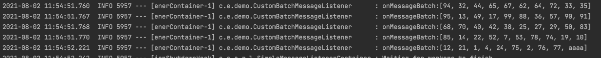
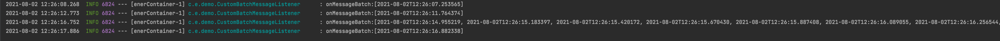

= AMQP Batched Message Examples

== BatchListener

BatchMessageListener 구현
[source,java]
----
public class CustomBatchMessageListener implements BatchMessageListener {

  @Override
  public void onMessageBatch(List<Message> messages) {
    List<String> payloadList = messages.stream().map(Message::getBody).map(String::new).collect(Collectors.toList());
    log.info("onMessageBatch:{}", payloadList);
  }
}
----

Container 설정
[source,java]
----
  @Bean
  public SimpleMessageListenerContainer simpleMessageListenerContainer(ConnectionFactory connectionFactory) {
    SimpleMessageListenerContainer container = new SimpleMessageListenerContainer();
    container.setConnectionFactory(connectionFactory);
    container.setQueueNames(QUEUE_A);
    container.setMessageListener(new CustomBatchMessageListener());
    container.setBatchSize(10);
    container.setConsumerBatchEnabled(true);
//    container.setDeBatchingEnabled(true);
    return container;
  }
----

== Test 결과
메시지를 최대 배치사이즈 만큼 한번에 읽어온다.

일정시간 간격으로 전송하는 경우, 한건씩 읽는다.

== References
https://docs.spring.io/spring-amqp/docs/current/reference/html/#de-batching